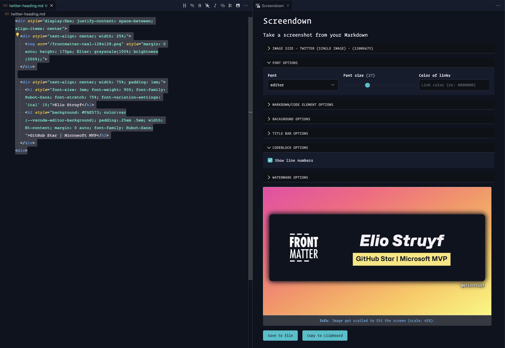
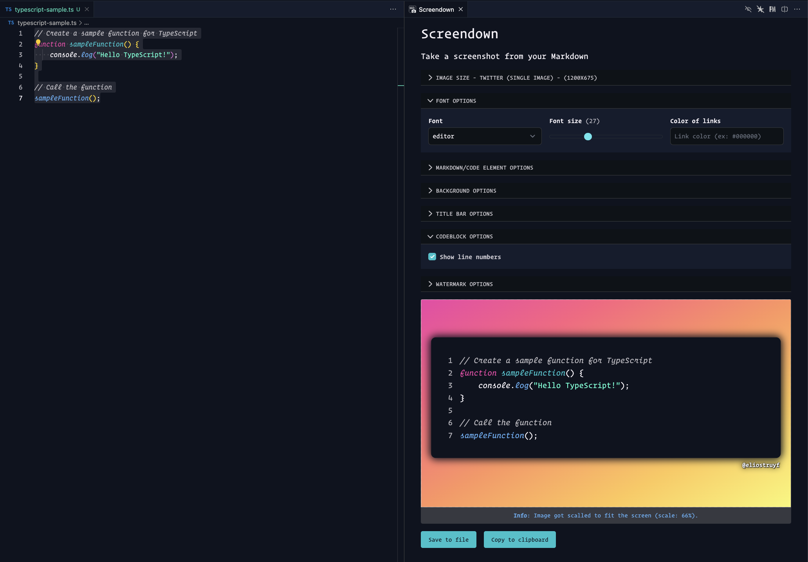

  

<h1 align="center">Screendown</h1>

<h2>📸 Capture stunning screenshots of your Markdown or code directly in Visual Studio Code with ease.</h2>

  

  

  

  

Screendown is a tool that allows you to take beautiful and professional-looking screenshots of your Markdown/Code from within Visual Studio Code. With Screendown, you can easily turn your markdown text or code into visually stunning images that will capture the attention of your readers and followers.

  

## Features

### Markdown to screenshot

By converting your Markdown to HTML, you can generate visually appealing images quickly and easily. This approach offers a convenient and efficient method for producing stunning visuals from your Markdown content.

  

The following markup is supported:

- Headings
- Paragraphs
- Lists
- Blockquotes
- Code blocks / inline code
- Horizontal rules
- Images
- Links
- Emphasis
- Strong
- Tables
- Strikethrough

### HTML to screenshot

If you have HTML content, you can also use Screendown to convert it to an image. This could be useful for creating some cool banners for Twitter, LinkedIn, ...

  

### Code to screenshot

When working with code, the tool will display the code within a code block and apply syntax highlighting based on your current Visual Studio Code theme.

  

### Watermarking

You can add a watermark to your image. This can be useful for adding your name/tagline/twitter handle to the image. If you want, you can also add an image, once you do this, the watermark will be combined with the image.

By default, you can place the image on the top or at the bottom, but you can also drag it around to place it wherever you want.

  

> **Info**: In case you want to add more lines of text, use the `\n` character to add a new line.

## Usage

- Open the command palette (Ctrl+Shift+P)
- Search for "Screendown: Take a screenshot"
- Select some Markdown text (you can also start with selecting Markdown text)

  

- Now you can fiddle with the settings to get the perfect image
- Click the `Take screenshot` button

## Issues/feedback

If you encounter any issues while using Screendown or have feedback on how to enhance its functionality, please feel free to add it to the Github repository's issue list. Your contributions can help improve Screendown and make it an even better tool for everyone.

[Add to our issue list](https://github.com/estruyf/screendown/issues)

 
 

  &nbsp;
  

